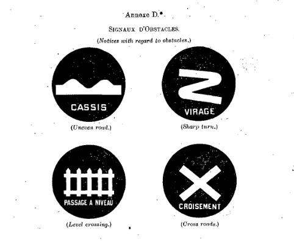
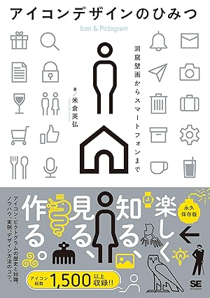

<!-- NOTE: アイコンの世界を覗くイメージで進めていきたい -->
## Chap1 アイコンとは何か？
### アイスブレイク: アイコン当てクイズ
> アプリアイコン、地図記号、家紋などをテーマに早押しクイズを行う。
> 最後にクソ問題を出題して、参加者にアイコンの意味を考えるきっかけを与える。

### アイコンとは何か？

## Chap2. アイコンの歴史
### 現代的なアイコンの起源は交通標識
直感的なメッセージの理解に図記号を用いる、という現代的なアプローチが初めてとられたのはフランス発の交通標識だと言われている。
必要は発明の母、というように自動車産業の発展とともに国境を越えた移動が可能となり交通網が整理されていく中で、言語に依存しない交通標識が求められるようになった。

ここでフランスの交通標識の歴史をサラッと見てみる。
[Road signs in France \- Wikipedia](https://en.wikipedia.org/wiki/Road_signs_in_France) によると、「1900年代にフランスで車が登場し始めたとき、ドライバーやサイクリストのための「Moderate Speed」または「Slow Down」という言葉が書かれた看板がありました。」
> When cars started appearing in France in the 1900s, there were signs for motorists and cyclists with the words "Moderate Speed" or "Slow Down".

この文字標識によりフランス語を理解できないことが原因で、イギリス人観光客やドイツ人ドライバーが読み取れずに進入禁止や優先道路を無視して衝突するケースがあったそう。

今までの象形文字や家紋のような絵記号は、深い意味があるけど直感的にわかりにくかった。
そのため視覚的にわかりやすいピクトグラムが必要とされ始めた。これは現代のアイコンに求められる要素の1つである。

交通標識の先駆けとして1909年にはフランスで既に4つのピクトグラムの交通標識が公に使われていた。
1. 凹凸道
2. カーブ
3. 踏切あり
4. 交差点

> 1909年にフランスで使われていた4つのピクトグラムの交通標識
> https://commons.wikimedia.org/wiki/File:1909_Paris_Convention_road_signs.jpg

初代Macintoshのアイコンをデザインしたスーザンケアは言った。
<!-- NOTE: これ核心だろ... -->
「**よいアイコンとは、イラストというより道路標識に近いものであり、アイデアを明確かつ簡潔に、そして印象的に表現することが理想だと考えています。**」

## Chap3. アイコンの作り方
手順は大きく分けて6ステップ
1. 目的を再確認
2. 対象をリサーチ
3. カタチのスタイル
4. ラフスケッチ
5. デジタル化
6. ブラッシュアップ

### 1. 目的を再確認
おおよそな目的は受けんでいるだろうが、改めて再確認する。
- Why?
  - 一目で情報を伝えたいからか
  - 情報の省スぺをしたいからか
  - 目立たせたいのか（遠くから見えるようにしたい）
  - ニューラルな表現にしたいからか
- Where?
  - アプリ・ソフトウェア
  - 雑誌・書籍
  - 広告・ポスター
  - 看板・標識
- Who?
  - 人間の属性によってデザインが変わる
  - 文法の理解度（そのデザインを初めて見る or 何回も見ている）
    - ハンバーガーメニューとか初見で分からへんやろ笑
  - 年齢（高齢者）
  - 性別（男性・女性）
  - 分野への理解度（初心者向け・上級者向け）
    - 職業、趣味などのバックグラウンドを考慮する
- What?
  - 何を伝えたいのか
  - 操作方法、機能、状態、注意など
  - 分かりにくいものの例
    - 試験管：プログラムのテスト？科学？薬品？
    - 歯車：設定？機械？工場？

### 2. 対象をリサーチ
まずはモチーフを決めよう。
その上で対象物〇〇が決まったら、「〇〇 アイコン」と検索してはダメ！
Google検索、Pinterestなどを使い〇〇について様々な面から調べてみる
→ アイデアの幅が広がる
例えば、歴史、文化、使用例など？

次にキーワードを書き出してみる。
〇〇から連想されるキーワードを10以上を目安に書き出してみる。
e.g. 「自転車」なら、車輪、ペダル、ハンドル、サドル、ブレーキ、チェーン、ライト、ベル、タイヤ、フレームなど

キーワードを書き出せたら、この中から動き・形を表現できそうなものを選び、カタチにして整理する。
このカタチから逆に連想できるキーワードをまとめてみる。

このキーワード → カタチ化 → キーワード のフローで何を描けばいいのかが見えてくる。
<!-- TODO: このフロー図をここに挿入 -->

### 3. スタイルを考える
- 細い ↔ 太い
- 四角い ↔ 丸い
- 薄い ↔ 濃い
- 単純 ↔ 複雑

アイコンのテーマを作るには？
→ 規則に従ってこれを繰り返しながらアイコンを作れば良い
> 規則が複雑すぎると、共通項を見いだしにくくなる恐れがあるので、規則は単純明快な方が好まれそう。

### 4. 紙の上で手を動かす
最初にデザインを始める際は紙に書き出そう。できるだけアプリ上で編集し始めない。
なぜなら、デザインの幅がアプリ上の編集技法による制約を受けてしまうから。最初は自由な線を描けるアナログから！

結局試行錯誤が必要。
この４手順を順列に進めていくのではなく、サイクルをイメージした方が良い。

<!-- TODO: ここにサイクルの図表を追加 -->

アイコンの作成手法
- グリッド
- トレース

その他に意識すること
- 余白
  - 小さいフォントサイズで潰れてしまわないか？
  - 円の隣接の際は補正が必要
- 角

<!-- ここらへんは手法の紹介のために比較用で複数のアイコンを作成するのは面倒くさい
流石に書籍内の資料を公開スライドで使用するわけには行かないし...
そのため、自分が一つこれらの手順を踏まえたアイコン1例を作成することにする！！ -->

## Chap4. アイコンのバリデーション
アイコンは「絵文字」。よって、フォントファミリーが参考になる。
- 太さ
- 字幅
- くり抜き(Outline)
- Dot
- Fill
- Blur

- アイコンの角をどれだけ丸くするかでベースが同じでも受ける印象が大きく変わる
- ベタ面を使う
  - 近年の主流はパスを主体にした、抜けの良い白っぽいアイコンで、ソリッドな（キレの良い）印象を与える
  - つまりより立体的な特徴を捉えている
  - しかし昔風の曲線を生かしたベタ面は可愛らしい印象を与える
  - ベタ面では特に白部分が重要になるので、1つの色という感覚で作るといい
<!-- NOTE: ベタ面については実際に作ったり、もう少し調べたりしないと良さをきちんと理解できないかも。漠然と好きではある -->

- パスを切る
  - 途中でパスが途切れさせる、隙間を作るのは近年の主流
  - 明るさ・抜けの良さが特徴
- カクカクしてみる
  - 縦・横・45度の直線のみで構成してみる
  - 円を使わない縛りも良い
- シルエットを作る
- ドット
  - 粗い・四角いドット数を使う：レトロゲーム風
  - 丸ドットで構成：電光掲示板風のデザインに
  - ラインスタイル風：点の大きさ・感覚が重要。うまく作れるとポップな印象を与えてくれる
- アクセントを与える
  - 色を使う
    - 一部に配色をしてアクセントを加える
    - 同じ形で色のシェイプをすべてのアイコンの一部に加える
      - 各アイコンのデザインが多少異なっても、この共通パーツによって統一感を演出できる = 違和感を軽減できる
    - 複数色使用して華やかなデザインに
  - 上から俯瞰したようなカタチ
  - ラインスタイルをいじる
    - 手書き風
    - 鉛筆風：シャープな印象。他のペン類を使うのもあり(e.g. マーカー、筆)
- グラデーション
  - 一気に魅力的になる
  - イラストのような印象も受ける
- ぼかし
  - アイコンの強調したい各パーツを制御できるようになる
  - ぼかしである部分が見えにくくなることで、逆に見えてくるものもある
  - 動きを演出できる
  - 物足りなさを感じたときにいろんなパーツをぼかしてみると新たな発見があるかも？
- 要素を足し引きする
  - ユーモアが生まれる
  - アイコンを組み合わせてみる(e.g. 走っている人のアイコンの頭を爆弾にしてみる)
  - アイコンを組み合わせてみる(e.g. 走っている人のアイコンの頭を爆弾にしてみる)
- シンプルなパーツで構成する
  - これはChap.3のグリッドみたいなアイコンの作成手法に似ている気がする
  - タングラムという四角形や三角形を組み合わせて動物などのモチーフを作るシルエットパズルがある。これみたいなイメージ
  - アイコンデザインの参考になるので、興味がある人は遊んでみてはいかが？

# 参考

[アイコンデザインのひみつ \| 米倉 英弘 \|本 \| 通販 \| Amazon](https://www.amazon.co.jp/%E3%82%A2%E3%82%A4%E3%82%B3%E3%83%B3%E3%83%87%E3%82%B6%E3%82%A4%E3%83%B3%E3%81%AE%E3%81%B2%E3%81%BF%E3%81%A4-%E7%B1%B3%E5%80%89-%E8%8B%B1%E5%BC%98/dp/4798177199)
